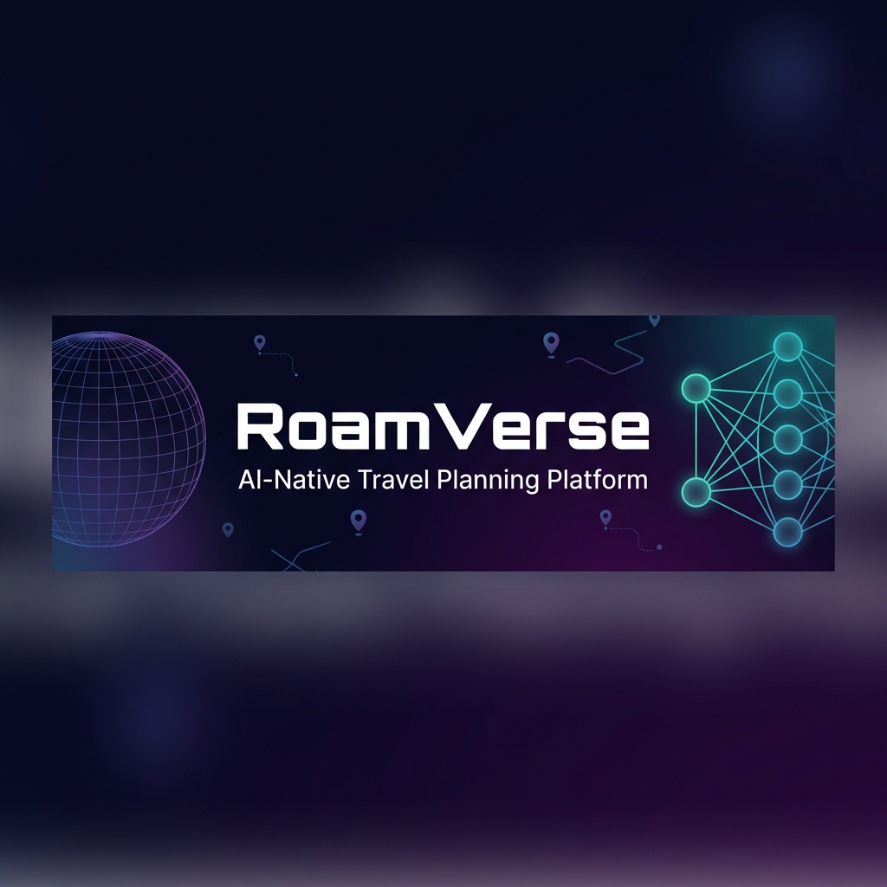
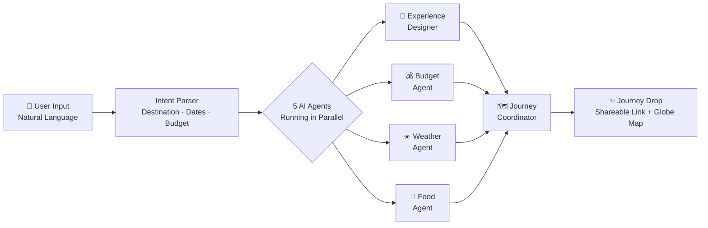

<div align="center">



<br/>

[](https://nextjs.org/)
[](https://fastapi.tiangolo.com/)
[](https://openai.com/)
[](https://supabase.com/)
[](https://www.typescriptlang.org/)

<br/>

### 🚀 [Try it Live Here: ai-travel-cyan.vercel.app](https://ai-travel-cyan.vercel.app)

**Describe your trip in plain words. 5 AI agents turn it into a complete, shareable travel plan in seconds.**

<br/>

[](https://github.com/mohammadali-2000/Ai_travel)
&nbsp;&nbsp;
[](https://github.com/mohammadali-2000/Ai_travel/fork)
&nbsp;&nbsp;
[](https://github.com/mohammadali-2000/Ai_travel)

</div>

---

## 🎬 Demo

https://github.com/mohammadali-2000/Ai_travel/raw/main/Project_Demo.mp4

---

## ✨ What is RoamVerse?

RoamVerse is an **AI-native travel planning platform** built for the OpenAI Build Week Hackathon 2026.

You just describe your trip in natural language — no forms, no dropdowns, no filters. A team of **5 specialized AI agents** coordinate behind the scenes to research, plan, and produce a complete **Journey Drop**: a beautiful, magazine-style travel plan with a live 3D globe route, shareable via a single link.

```
You type:  "Bhopal for 10 days solo under ₹15,000"
         ↓
  5 AI Agents get to work...
         ↓
  Full itinerary + budget + weather + food guide + interactive globe map
```

---

## 🤖 Meet the AI Team

<div align="center">

| Agent | Role | What it does |
|:---:|:---:|:---|
| 🎨 | **Experience Designer** | Shapes the emotional arc and narrative of your trip |
| 💰 | **Budget Agent** | Allocates every rupee intelligently within your limit |
| ☀️ | **Weather Agent** | Adapts the plan around real seasonal conditions |
| 🍜 | **Food Agent** | Curates authentic local food experiences by neighborhood |
| 🗺️ | **Journey Coordinator** | Unifies all agent outputs into one shareable Journey Drop |

</div>

---

## 🗺️ How it Works



---

## ⚡ Features

<div align="center">

| Feature | Status |
|:---|:---:|
| Natural language trip input | ✅ |
| Multi-agent AI orchestration (5 agents) | ✅ |
| Day-by-day itinerary with mood & timing | ✅ |
| Budget breakdown per category | ✅ |
| Weather-aware planning | ✅ |
| Interactive 3D globe route map | ✅ |
| Shareable "Journey Drop" link | ✅ |
| INR budget support for Indian trips | ✅ |
| Magazine-style trip output | ✅ |

</div>

---

## 🛠️ Tech Stack

<div align="center">

| Layer | Technology |
|:---|:---|
| 🖥️ **Frontend** | Next.js 15, React 19, TypeScript |
| ⚙️ **Backend** | FastAPI, Python 3.12 |
| 🤖 **AI** | OpenAI Responses API + Agents SDK |
| 🗄️ **Database** | Supabase (Postgres + Auth + Storage) |
| 🌍 **Maps** | react-globe.gl |
| 🎨 **Styling** | Tailwind CSS, Framer Motion |
| 🚀 **Deploy** | Vercel (web) · Docker-ready (API) |

</div>

---

## 📁 Project Structure

```
Ai_travel/
├── apps/
│   ├── web/                 → Next.js 15 frontend
│   │   ├── src/
│   │   │   ├── app/         → Pages & API routes
│   │   │   ├── components/  → UI components
│   │   │   └── lib/         → Intent parser, utils
│   └── api/                 → FastAPI backend
│       └── app/
│           ├── agents/      → AI agent definitions
│           └── models/      → Data models
├── packages/
│   └── shared-types/        → Shared TypeScript contracts
├── agents/                  → Agent specs & prompts
└── docs/                    → Engineering docs
```

---

## 🚀 Running Locally

<details>
<summary><b>📋 Prerequisites</b></summary>

- Node.js 18+
- Python 3.12+
- An OpenAI API key → [platform.openai.com](https://platform.openai.com)
- A Supabase project (free tier works) → [supabase.com](https://supabase.com)

</details>

<details>
<summary><b>⚙️ Step 1 — Clone & configure</b></summary>

```bash
git clone https://github.com/mohammadali-2000/Ai_travel.git
cd Ai_travel

# Copy env templates
cp .env.example .env
cp apps/web/.env.local.example apps/web/.env.local
cp apps/api/.env.example apps/api/.env
```

Fill in `apps/api/.env`:
```env
OPENAI_API_KEY=sk-...
SUPABASE_URL=https://your-project.supabase.co
SUPABASE_SERVICE_ROLE_KEY=...
```

</details>

<details>
<summary><b>🖥️ Step 2 — Run the web app</b></summary>

```bash
cd apps/web
npm install
npm run dev
```

Open → [http://localhost:3000](http://localhost:3000)

</details>

<details>
<summary><b>⚙️ Step 3 — Run the API (for full AI generation)</b></summary>

```bash
cd apps/api
python -m venv .venv
source .venv/bin/activate      # Windows: .venv\Scripts\activate
pip install -e '.[dev]'
uvicorn app.main:app --reload
```

API runs at → [http://localhost:8000](http://localhost:8000)

</details>

<details>
<summary><b>🗄️ Step 4 — Set up database</b></summary>

Apply the migration in your [Supabase SQL editor](https://supabase.com/dashboard):

```sql
-- Run this file:
supabase/migrations/202607180001_create_trips.sql
```

</details>

---

## 📖 Documentation

| Doc | Description |
|:---|:---|
| [Product Vision](docs/product-vision.md) | What we're building and why |
| [Development Guide](docs/development.md) | Local setup deep dive |
| [System Architecture](architecture/system-design.md) | How the pieces connect |
| [API Conventions](docs/api-conventions.md) | Backend API reference |
| [Agent Catalog](agents/README.md) | All 5 AI agents documented |

---

<div align="center">

### Built with ❤️ by [Mohammad Ali](https://github.com/mohammadali-2000)

**OpenAI Build Week Community Hackathon · 2026**

<br/>

*If you found this useful, drop a ⭐ — it means a lot!*

</div>
